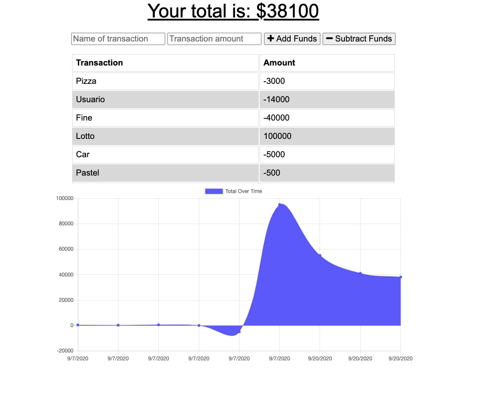

# Budget Tracker

  ## Description
  An APP that keeps track of your daily finance, done with Mongo database, a Mongoose schema and handles routes with Express. The app also continues to work even when there is no internet access thanks to its indexedDB offline backup database.

  
  
  ## Table of contents
  
  * [Installation](#installation)
  * [Usage](#usage)
  * [License](#license)
  * [Contributing](#contributing)
  * [Questions](#questions)
  

  ## Installation
  
  This app is hosted on heroku. You can access the app by clicking [here](https://guedesantonio-budget-tracker.herokuapp.com/).
  
  ## Usage

  The user will be able to add expenses and deposits to their budget with or without a connection. When entering transactions offline, they should populate the total when brought back online.

  ## License
  This project is licensed under the MIT.

  ## Contributing
  See [Questions](#Questions) section.

  ## Questions
  If you have any questions about the repo, open an issue or contact me directly at gguedesantonio@gmail.com. 
  You can find more about my work at [Github profile](https://github.com/guedesantonio).